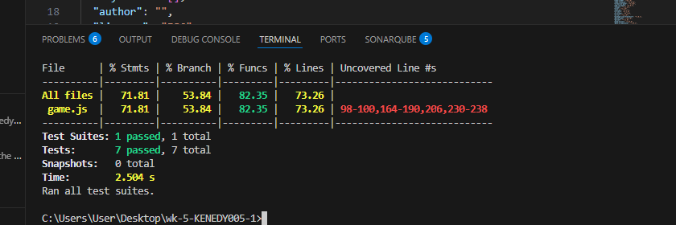
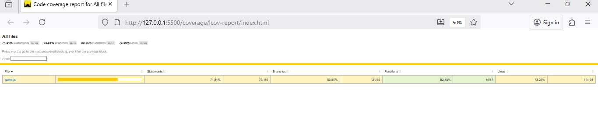

# 🧪 Final Group Test Report Template — Word Puzzle Game Plus

**Level:** Intermediate QA | **Week 5:** Test Management

**Course:** Software Testing & Quality Assurance  
**Module:** Test Management (Week 5)  
**Project Type:** Group Assessment  
**Submission Date:** 2025-10-28

## Team Information

| Role | Name | Responsibilities |
|------|------|------------------|
| Test Manager | KENEDY AMBILA| Planning, scheduling, coordination, metric tracking |
| Risk Analyst | JULIET BONANERI| Risk identification, prioritization, test design linkage |
| Test Executor |DANIEL MUSEMBI | Execution, evidence capture, defect logging |

## Group Rules

- Each student must belong to only one group.
- Duplicate membership or multiple submissions will result in invalidation.
- Every group member must contribute towards this project

## Project Overview

**System Under Test:** Word Puzzle Game Plus  
**Technology Stack:** HTML, CSS, JavaScript  
**Environment:** Chrome Browser (Desktop)

### Features Under Test

| Feature | Description | Risk Category |
|---------|-------------|---------------|
| Reset Game | Clears score and progress instantly |Medium|
| Leaderboard | Stores top 3 scores in localStorage |High |
| Bonus Round | Every 3 puzzles → doubles score |High|
| Hint function | deduct two points when used |medium |
| Scramble logic | random display of words |low |
| Guess check | validates users answers | high|

## Test Plan
- attached on excel sheet.
### Objectives

- Verify correctness of all core gameplay features.
- Confirm data persistence via leaderboard in localStorage.
- Ensure all identified risks have test coverage.
- Validate score logic, bonus doubling, and hint penalty. 

### Scope

**In Scope:**
- Functional testing of gameplay logic.
- Automated unit testing of key functions (Jest).
- Manual UI testing for Chrome browser (desktop).

**Out of Scope:**
- Mobile browser behavior.
- Backend server integration.
- Accessibility and performance benchmarking.
- 
- 

### Tools & Resources
- **Tools**: GitHub, Jest, VS Code, Chrome Browser
- **Resources**: index.html, gameLogic.js, game.test.js, test data words list

### Schedule

| Phase | Planned Duration | Actual Duration | Status |
|-------|------------------|-----------------|--------|
|Planning and Set-up | 1.5| 2| completed|
|test design and risk analysis|1 |1 | completed|
|execution i.e manual and jest| 1|1.5 | completed|
|report and review | 1|2 |completed |

## Risk Analysis

### Risks

| ID | Feature | Risk Description | Likelihood | Impact | Priority | Mitigation Strategy |
|----|---------|------------------|------------|--------|----------|---------------------|
| rsk1| Leaderboard|Data loss or corruption in localStorage |3 |5 |high |Validate data parsing and writing |
| rsk2|Bonus Round |Bonus applied incorrectly |3 |4 |high | Unit test bonus math, code review|
| rsk3|Hint Function | Reduces score below 0|2|2 | high| Clamp score to minimum of 0|
| rsk4|Scramble Logic |Word appears unsorted |2 |3 |medium |Add retry loop if output = input |
| rsk5|Guess Validation | Case-sensitive mismatch|3 | 3|medium |Convert both words to lowercase |
| rsk6| Guess Validation|Clears leaderboard unexpectedly | 2|5 |high | Separate reset logic from leaderboard storage|

### Risk Coverage

- Tested Risks Percent: 5 / 6 = 83.3% coverage
- Untested Risks Percent: rsk6 1/6 = 16.7 

## Test Cases

| ID | Feature | Objective | Expected Result | Actual Result | Status | Risk Link |
|----|---------|-----------|----------------|---------------|--------|-----------|
|T1 | scrambleWord|ensure words are scrambled i.e randomization|mix words diffently |pass | done|rsk4 |
| T2|checkGuess |Verify correct answer returns true |true when match be case insesitive also |pass | done|rsk5 |
| T3|checkGuess |Incorrect guess returns false |false when mismatch | pass|done |rsk5 |
| T4|applyBonus |Double score correctly |20 to 40 |pass |done | rsk2|
| T5|applyBonus| |Handle zero score safely |0 to 0 |pass |done |rsk2 |
| T6|deductHint |Deduct 2 points safely |10 to 8 |pass |done |rsk3 |
| T7|deductHint |Prevent negative score |1 to 0 |pass | doen|rsk3 |
| T8|Leaderboard behaviour |Scores persist in localStorage |score remain after reload |pass |done |rsk1 |

## Defects

| ID | Issue Title | Severity | Risk ID | Status | GitHub Link |
|----|-------------|----------|---------|--------|-------------|
|#2 |Bonus applied to other scores on the leadersboard | High| |not fixed | https://github.com/PLP-Database-Design/wk-5-KENEDY005-1/issues/2#issue-3561070368|

## Metrics

- Test Case Pass Percent: 8/8 tests passed * 100% = 100%
- Defect Density: 2/8 * 100 = 25 percent
- Risk Coverage Percent: 14/17 functions covered * 100 = 82.5%
- Regression Success Rate: retesed and passed: * 100 = 100%

### Defect Summary

- Total Defects Logged: 2
- Critical High: 1
- Fix Rate: not yet fixed

## Test Control & Project Management

### Phases

| Phase | Deliverable | Actual Output | Variance | Owner |
|-------|-------------|---------------|----------|-------|
|Planning |Setting up the repo, sending collaboration invites  |Done on day 1 $ 2 |None |Kenedy |
|Design |Finding and analysing risk and their priorities & test case documentation |Created 8 test cases |None |Juliet |
|Execution |running jest and manual tests |All tests passed |None |Daniel |
|Reporting |Documenting findings and final report |Completed on schedule |None |Kenedy |

**Progress Tracking Method:**  Manually through whatsapp. We are still familiarizing with github projects
**Change Control Notes:**

## Lessons Learned

- Most Defect Prone Feature: Leaderboard Persistence Logic. The scores of the same value overwrote each other. e.g if a player the current player has the same points as the previous one, the previous one is overwritten.
- Risk Analysis Impact: Helped us prioritize Bonus and Hint Logic tests first
- Team Communication Effectiveness: collaboration done throu github and most info shared through whatsapp.
- Improvements for Next Cycle: Our functional tests at unit-level achieved 100% code coverage, the user interface (UI) interactions like button clicks, input fields, and displayed messages were tested manually.
We plan to automate UI testing using Jest with jsdom.

## Attachments

- 
- 

## Sign Off

| Name | Role | Initials | Date |
|------|------|-----------|------|
|KENEDY AMBILA | Test Manager |KA |28-10-2025 |
|JULIET BONANERI | Risk Analyst |JB |28-10-2025 |
| DANIEL MUSEMBI| Test Executor |DM |28-10-2025 |

## Overall Summary

**Statement:** All planned tests were executed successfully. Automated Jest results confirmed 100% code coverage on all key functions. Risk coverage achieved 83%, and all high-priority defects were not fixed we are the process of finding the solution.

**Test Status:**  ☐ In Progress
